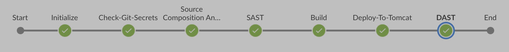

# DevSecOps - Implementing Secure CI/CD PipelinesDME

This is a sample Web Application from DEVSECOPS#1  Introduction - Implementing Secure CI/CD Pipelines [demo](https://youtu.be/egTi9U9vw3E)

## Build Instruction

```text
mvn clean package #Leveraging Maven
```

## High Level Overview

Deploys JAVA application ```target/WebApp.war``` on Tomcat Web Server. This is a jenkins CI/CD pipleine that has security checks. (DevSecOp)

## Tools

- Jenkins - Pipeline
- Github - Source Code Manager
- TruffleHog - Secrets Scanner (docker)
- owasp/dependency-check - Software Composition Analysis (SCA)(bash script)
- Sonarqube - SAST (docker container)
- Maven - Build ( running on instance)
- Tomcat - Web HTTP server that run java code (running on instance)
- Zap - DAST (running on docker)


